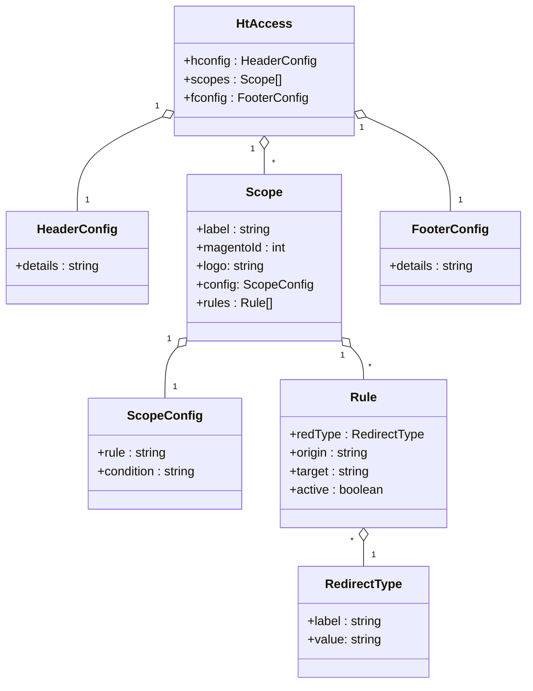

# installation process

you must have [sqlite3](#sqlite3) and [angular-cli](https://www.npmjs.com/package/@angular/cli) to run this application in development mode  

```sh
npm i
npm run create:database
npm start
```

## build

```sh
npm run package:win
npm run package:linux
npm run package:osx
npm run package:all
```

## development build steps

the process to set up this app

### installing bootstrap

`npm i bootstrap`  
**follow this:**  
[add bootstrap in angular app](https://techincent.com/how-to-add-bootstrap-5-in-the-angular-application/)

### using electron with angular

**follow this:**  
[tutorial](https://pkief.medium.com/angular-desktop-apps-a9ce9e3574e8)

---

## DB part

### knex

`npm i knex`

### sqlite3

don't forget to install sqlite driver for windows ;  
[sqlite installation tutorial](https://www.tutorialspoint.com/sqlite/sqlite_installation.htm)  
[dowload](https://www.sqlite.org/2022/sqlite-tools-win32-x86-3390400.zip)  

- Put it in `C:\\sqlite3\` folder  

- Add it to the Path :
  - <kbd>Windows key</kbd> > type 'variables';  
  - in Environment Variable:  
  Path ... add; `C:\\sqlite3\`  

- then in terminal:  

  `npm i sqlite3`  

### electron-rebuild  

`npm i electron-rebuild`  
add this line in script section of package .json  

```json
"scripts"{
  [...]
  "rebuild": "electron-rebuild -f -w sqlite3",
  [...]
}
```

### rebuild sqlite3

need to install all dependency for `sqlite3`, like `Visual studio`, `python 2.7` etc
if not run:

``` bash
npm install -g windows-build-tools
```  

it will install all dependency for in windows.

then build sqlite3 with electron-rebuild.

``` bash
npm run rebuild
```  

This will rebuild electron with sqlite

### database creation

If the `./data/database.db` file does not exist, run:

```bash
npm run create-database
```  

**/!\ to do only once /!\\**  
This will create the database and populate it with basic rules  
see:  `src\electron\build_db.js`

---

the db schema look like this:



---

## communication between front and back

### using ipcEvent / ipcMain  from electron

...  for the electron part  
set on CreateWindows Method :

```js
win = new BrowserWindow({
    [...]
    /* Must be set !! or electronSrv.ipcRenderer will always be null */
    webPreferences: { nodeIntegration: true, enableRemoteModule: true, contextIsolation: false },  
    ipcRenderer: ipcRenderer, // send ipcRenderer to the front
    isElectron: true,
    [...]
});
```

#### to get event from the Angular app  

```js
ipcMain.on("test", (_event,data)=>{console.log('test',data)}); // listen for 'test' event from the frontend
```

### using ipcRenderer / ipcMain  from ngx-electron

... for angular part !  
`npm i ngx-electron`  

---

### make Some changes in the module ngx-electron

in `node_modules\ngx-electron\lib\electron.service.d.ts`  
**/!\\**   must comment the line :  **/!\\**  

```ts
(17) // readonly remote: Electron.Remote;
```

to resolve the f****g bug:  
'Electron.ipcRenderer is always null'  

### Bonus:  use 'patch-package'

`npm i patch-package`  
[patch-package doc](https://www.npmjs.com/package/patch-package)  
to apply the correction and make it persistant after using npm  

---

in the app.module.ts:  

```js
import { NgxElectronModule } from 'ngx-electron';
```

[ngx-electron](https://www.npmjs.com/package/ngx-electron)

```js
@NgModule({
  [...]
  imports: [
    [...]
    NgxElectronModule, // <- import here
    [...]
  ],
  [...]
})
```

in the component.ts

```js
constructor(
    ...
    private electronSrv: ElectronService,
    ...
  ) {}
```

```js
if(this.electronSrv.isElectronApp){ // check if is in electron app
  this.electronSrv.ipcRenderer.send('test',{test:'yooo'}); // send to backend
}
```

---

### force dom update on event

So angular update the dom automatically on user action (like click) but when you work with ipc_events  the dom is not updated. the `ChangeDetectorRef` Class is made for that:  
in the ``component.ts``:  
import the class  

```js
import { ChangeDetectorRef } from '@angular/core';
```

inject it in the constructor:  

```js
constructor(
    ...
    private ref: ChangeDetectorRef
    ...
  ) {}
```

then use it to force the dom reload

```js
this.electronSrv.ipcRenderer.on(
        'rule:checked',
        (_event, response: any) => {
          // make any changes
          this.ref.detectChanges(); // force reload
        }
      );
```

---

## cool drag and drop

`npm i ngx-smooth-dnd`  
[ngx-smooth-dnd](https://github.com/kutlugsahin/ngx-smooth-dnd)  
[demo](https://kutlugsahin.github.io/ngx-smooth-dnd/)  

---

node 14.15.4

---

## use electron-store

`npm i electron-store`
[electron-store](https://github.com/sindresorhus/electron-store)  

```js
const Store = require('electron-store');
const store = new Store();

store.set('unicorn', '🦄');
console.log(store.get('unicorn'));
//=> '🦄'

// Use dot-notation to access nested properties
store.set('foo.bar', true);
console.log(store.get('foo'));
//=> {bar: true}

store.delete('unicorn');
console.log(store.get('unicorn'));
//=> undefined
 ```

### set schema  

[src\electron\localStorage.js](src/electron/localStorage.js)

 ```js
 const Store = require('electron-store');
const schema = {
 foo: {
  type: 'number',
  maximum: 100,
  minimum: 1,
  default: 50
 },
 bar: {
  type: 'string',
  format: 'url'
 }
};


const store = new Store({schema});
console.log(store.get('foo'));
//=> 50

store.set('foo', '1');
// [Error: Config schema violation: `foo` should be number]
 
 ```

### free spinners

[svg-spinners](https://github.com/n3r4zzurr0/svg-spinners)

---

### free icons

[iconoir](https://iconoir.com/)

---

### diagram in github

[doc mermaid](https://mermaid-js.github.io/mermaid/#/)  
[live editor](https://mermaid-js.github.io/mermaid-live-editor)  

---

### to access angular routes from outside  

in .htaccess files in the root/wwww/public folder in the server.

```apache
RewriteEngine on
RewriteCond %{REQUEST_FILENAME} -s [OR]
RewriteCond %{REQUEST_FILENAME} -l [OR]
RewriteCond %{REQUEST_FILENAME} -d
RewriteRule ^.*$ - [NC,L]

RewriteRule ^(.*) ./index.html [NC,L]
```

and change basedir in index.html:  

```html
<base href="./">
```

---

### @angular/animation O_0  

[www.animationsftw.in](https://www.animationsftw.in/#/)

---

### in the future?  

> for i18n custom component ?

[publish an angular component to npm](https://jasonwatmore.com/post/2020/06/16/angular-npm-how-to-publish-an-angular-component-to-npm)
